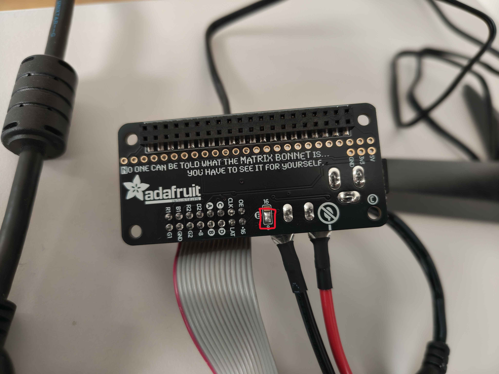

# HVV Display
This "Tutorial" will show you how you can setup your own Matrix LED Display that displays departures from your local station


## Hardware needed
You don't need to use the same hardware I do here but this tutorial is tailored to exactly this hardware combination, so keep that in mind

### Important disclaimer
If you also want to use a 64x64 Matrix LED display you will need a soldering iron to solder a connector on the bonnet, I will explain how to do this below

### Controller
As a controller, I used an old Raspberry PI 3b I still had from another project, you can find it [here](https://www.raspberrypi.com/products/raspberry-pi-3-model-b/)

### Display
The display is a 64x64 Matrix LED display from Adafruit with a 3mm pitch, you can buy it [here](https://www.adafruit.com/product/4732)

###  Connector
To connect the display to the controller I used the Matrix bonnet from Adafruit, which you can find [here](https://www.raspberrypi.com/products/raspberry-pi-3-model-b/)

## Soldering the connector for 64x64 Matrix LED Display support
If you bought the exact hardware I did you will need to solder a connector on your Matrix Bonnet.

On the backside you will find 3 soldering pads labeled "16", "E" and "8", you need to put a connector between "E" and "8"



## Getting Geofox API access
To get the latest departure data from HVV you will need access to the geofox API, information on how you can get this access is written here:
https://www.hvv.de/de/fahrplaene/abruf-fahrplaninfos/datenabruf
It involves writing a email explaining why you need access to the API, you will then get a user and password which you can use to authenticate yourself and get realtime departure infos

## Setting up your controller
Once you installed an OS on the pi (I used Raspberry Pi OS Lite) you need to download and install and run this script: https://raw.githubusercontent.com/adafruit/raspberry-pi-installer-scripts/master/rgb-matrix.sh
Select your hardware and let the installer finish

Now go into the bindings/python directory and run
```bash
sudo PIP_BREAK_SYSTEM_PACKAGES=1 python3 setup.py install
```
let it finish and you are basically done!

### Start the script
Clone the repository and create a file called secrets.json in the directory
In there, add the following data:
```JSON
{
    "geofox_pass": "<PASS>",
    "geofox_user": "<USER>"
}
```
Make sure to replace pass and user with the password and username you have received from the geofox API team
Now you can execute the hvv_display.py script as root user and are done!
If you want to change the station, you can change it in hvv_display.py in the variable STATION_NAME

## Authors
- [@dnz-c](https://www.github.com/dnz-c)
